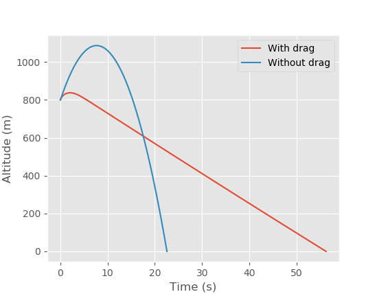

# ODESSA

ODESSA (ODE System Solving Accelerator) is a Python package that leverages Numba and SciPy solvers to accelerate the solving of ODE systems in a modular fashion.

- [ODESSA](#odessa)
  - [Installation](#installation)
  - [Basic principles](#basic-principles)
  - [Modules](#modules)
    - [Necessary components](#necessary-components)
    - [Example](#example)
      - [Spec lists](#spec-lists)
      - [Jitclass](#jitclass)
    - [Special modules](#special-modules)
      - [Core](#core)
      - [Empty](#empty)
  - [Configuration](#configuration)
    - [Phases](#phases)
      - [Modules](#modules-1)
      - [Events](#events)
      - [Using multiple phases](#using-multiple-phases)
    - [Core](#core-1)
    - [Simulation](#simulation)
  - [Demo](#demo)
  - [Contribution](#contribution)
    - [Issues](#issues)
    - [Testing](#testing)
    - [Branches](#branches)

---
## Installation

Installation is straightforward. Clone the project, go to the root folder '`ODESSA`' and install using pip.
```bash
$ git clone git@github.com:nsarrazin/ODESSA.git
$ cd ODESSA
$ pip install -e .
```
---
## Basic principles

ODESSA deals with ODEs written in the following form :

$\dot{x}(t) = f(t, x(t)) \quad \text{ for } t \in [t_0, t_f]$

Now in order to express the right-hand-side (RHS) function it was chosen to use a list of modules that are run one after the other serially. All these modules modify the attributes of a central Core module that holds the state variable, as well as any information that needs to be passed between modules.

A pseudocode description of that would be :

```python
def RHS(Core, t, y):
    Core.t = t
    Core.y = y

    module1.rhs(Core) # Core is modified in the rhs method of the modules
    module2.rhs(Core)
    # Ḿore modules here...

    return Core.dy
```

That `RHS` function is what the SciPy solver would call to determine the solution to the ODE problem.

This modular approachs allows for the quick isolation of parts of the simulation. For example aerodynamics effect can be removed from a simulation by removing a module, or a different gravitational model can be used simply by swapping modules.

---
## Modules

A module in ODESSA is a class that gets called at every step during the simulation.

### Necessary components
A module must contain the following :

* An `id` attribute, a string containing a unique identifier for that class. This is how ODESSA knows which module to pick when reading a configuration file.
* A `type` attribute, a string containing the type of module. It can be **any string** but we use the following :
  * `Aero` for aerodynamics forces modules
  * `Atmos` for the computation of atmospheric properties
  * `Dynamics` for solving the equations of motions
  * `Disturbances` for various other forces (roll control for example)
  * `Gravity` for the computation of gravitational forces.
  * `Mass` for the setting of mass and moment of inertia.
  * `Thrust` for the computation of thrust forces.
  * `Tower` for the rigid constraints created by a launch tower.
* A `rhs` method with a reference to a `Core` object. It's this method that is called every step of the simulation.

Optionally, a module can also contain more attributes (integers, arrays, etc.) that are used in the `rhs` method and can be set at runtime.

### Example
#### Spec lists

ODESSA uses jitclasses for modules, they are the Numba equivalent of normal Python classes. (More about them [here](https://numba.pydata.org/numba-doc/dev/user/jitclass.html)) One of the main differences is that they are statically typed. Therefore when creating a jitclass, one must pass a spec list specifying the type of each attribute used by the class. This looks something like this :

```python
import numba as nb
# from odessa.modules.Empty import empty_spec

# contains the specs for the minimum attributes required by ODESSA for all modules
empty_spec = [('id', nb.types.string),
              ('type', nb.types.string)]

# we add our module-specific attributes specs
aero_spec = empty_spec + \
        [("drags", nb.float64[:]),
          ("machs", nb.float64[:])]
```

#### Jitclass
Now we can create the jitclass itself :
```python
# the jitclass decorator is used to turn a class into a jitclass
# with a reference to the specs we wrote above.
@nb.jitclass(aero_spec)
class AeroBasic(object):
    def __init__(self):
        # the mandatory attributes so ODESSA knows what to call this module in a config file
        self.id = 'AeroBasic'
        self.type = 'Aero'

        # our module-specific attributes, they are basically empty by default,
        # and get overwritten by the config file
        self.drags = np.zeros(1, dtype=np.float64)
        self.machs = np.zeros(1, dtype=np.float64)

    def rhs(self, Core):
        # get the speed from the Core object
        v_tas = Core.vel

        v = np.sqrt(v_tas[0]**2 + v_tas[1]**2 + v_tas[2]**2)

        if v == 0.:
            # we exit if the speed is zero, there's not going to be any drag
            return

        mach = v/Core.a

        drag = interp_one(mach, self.machs, self.drags)

        F_drag = -1*0.5*Core.rho*drag*v**2

        # the Core has a force attribute (an array) that gets updated in place by the module
        Core.force[0] += F_drag*v_tas[0]/v
        Core.force[1] += F_drag*v_tas[1]/v
        Core.force[2] += F_drag*v_tas[2]/v
```
### Special modules
There are currently two special types of modules that differ from the rules above.
#### Core
The `Core` modules deal mostly with storing the state variables as well as any information that gets used by modules. (For example, time, position, velocity, force, acceleration, speed of sound and atmospheric density)

A `Core` module must have at least the two following setters and getters:
* A setter for `y`, that sets the state variable at the beginning of the step, for example :
```python
    @property
    def y(self):
        return np.hstack((self._pos, self.vel))

    @y.setter
    def y(self, y):
        self.pos = np.array([y[0], y[1], y[2]])
        self.vel = np.array([y[3], y[4], y[5]])
```
* a getter for `dy` that returns the derivative of the state variable at the end of the step, for example :
```python
    @property
    def dy(self):
        return np.hstack((self.vel, self.acc))
```
More information about setters and getters can be found [here](https://docs.python.org/3/library/functions.html#property).

As an end-user you probably don't need to create new `Core` modules. You might have to add attributes to it to pass information between other modules.

For example the `Core3DoF` and `Core6DoF` both have a `rho` attribute that represents air density. While it is not part of the state variables, the air density is determined by the `Atmos` module but is needed by the `Aero` module to compute drag. In order to do that since modules can only pass information through the `Core`, there needs to be a `rho` attribute in the `Core` that is set by `Atmos` and read by `Aero`.

 Same goes for other variables that are important but not part of the state variables, such as mass, moment of inertia, speed of sound, etc.

#### Empty
The `Empty` module is the default module, its `rhs` method does nothing. When a module isn't specified in a configuration file, this is what's being used by default.

---
## Configuration
ODESSA uses JSON files as the main way to quickly build simulations. JSON are human-readable, they can be easily parsed and allow you to reproduce simulations easily on two different machines.

A simple JSON config file was created for demonstration purposes.
```json
{
    "phases": [
      {
        "modules": {
          "mass.ConstantMass": {
            "mass": 15
          },
          "atmos.AtmosISA": {},
          "aero.AeroRTS": {
            "drags": [1,1,1],
            "machs": [0,1,999],
            "wind_alts": [0,100000],
            "wind_speeds": [0,0],
            "wind_headings": [0,0]
          },
          "gravity.GravityRTS": {},
          "dynamics.DynamicsRTS": {}
       },
       "events" : { "ground.groundLLA" : {"terminal" : true}}
      }
    ],
    "Core": {
      "id": "core.Core3DoF",
      "vel": [75,25,25],
      "lla": [0,0,800]
    },
    "Simulation": {
      "dt": "0.1",
      "tf": 18000,
      "method": "LSODA"
    }
  }
  ```

There are 3 important keywords at the root of this JSON. ``phases``, ``Core`` and ``Simulation``. Let's look at them step by step.

### Phases

The phases keyword contains a list of `Phase` objects represented as dictionaries (in our example there is just one phase) which have two keywords each. The first one is `modules` which just contains a list of modules to be run and their parameters and the second one is `event`.
#### Modules

We explained above what a module is. In the configuration file, they are represented with a unique identifier. Something like `mass.ConstantMass` or `aero.AeroRTS`, this comes from the path of the module class relative to the `modules` folder. So the general formula is `"folder.subfolder.classname"`.

Modules **are executed in the order that they are declared in the config file**. This means that you should pay close attention to how you order your modules in the configuration file. Some general ordering tips :

* `Mass` and `Atmos` modules should always be at the top as they set the mass and atmos properties used by other modules.
* Then come forces so `Gravity`, `Aero` , `Thrust` etc.
* Then after that we have rigid constraints so `Tower` and the likes.
* Then ultimately `Dynamics` because it solves the equations of motions so it needs to be last.

#### Events
One simple way to run a simulation is just to select which modules you want to use and let it run til the end of the integration period specified in the solver. But for most practical cases, there are some conditions under which you want to end the simulation early, for example the rocket hitting the ground.

Thankfully SciPy supports this and lets you end the simulation under specific conditions through the use of an event function. This function is evaluated at every step of the integration and if its value crosses the zero line then the integration is stopped early. Here is a basic example of an event function that stops after 40s :

```python
def event(t,y):
    """
    Basic event function that is evaluated at every step and will
    return 0 when the integration time reaches 40, stopping the
    integrator.
    """
    return 40-t
```

In our JSON example defined above it's the ground function `groundLLA` that simply returns the altitude, and when it crosses the zero line, the integration stops early.

You can set multiple events in order to have multiple triggers. For example if you were to write the following :

```json
      "events":
      {
        "ground.groundLLA":
        {
          "terminal": true
        },
        "time.fixedTime":
        {
          "t_event": 10,
          "terminal": true
        }
      }

```

The simulation would end after 10s or if the rocket hit the ground first. The key for events, `ground.groundLLA` and the likes are based on the same principle as the key for modules we talked about earlier.

#### Using multiple phases
The main advantage of using a list of Phases instead of a fixed list of modules is that you can use different sets of modules in each phases and change the way the system behaves dynamically.

For example for the flight of a rocket you could have a powered phase with a `Thrust` module and then at engine cutoff (determined by an event) you switch to a ballistic phase without a `Thrust` module, and maybe at some defined altitude above ground you switch to a phase with an extra `Parachute` module to simulate parachute dynamics.

### Core
The Core object is how every module interacts with the rest of the system. In the JSON file you can set the Core type, as well as the initial conditions of the simulation by directly setting all the state variables. (In this case `vel` and `lla`)

### Simulation
This keyword holds all the meta-parameters of the simulation such as maximum timestep, maximum integration period as well as integration method (full list available [here](https://docs.scipy.org/doc/scipy/reference/generated/scipy.integrate.solve_ivp.html#scipy.integrate.solve_ivp)).

---
## Demo

Using the JSON created above a simple simulation can be put together quickly.

```python
from odessa.simulation import Simulation
from odessa.helpers.frames import ecef_to_wgs84

import numpy as np
import matplotlib.pyplot as plt

from pathlib import Path

import os

plt.style.use('ggplot')

fig = plt.figure()

# read the JSON
filepath = 'config_demo.json'

dirname = os.path.dirname(__file__)
filename = os.path.join(dirname, filepath)
config = Path(filename).read_text()

# create a Simulation object from JSON
sim = Simulation.fromJSON(config)

# actually run the simulation
sols = sim.run()

for sol in sols:
    lla = np.array([ecef_to_wgs84([sol.y[0][i],sol.y[1][i],sol.y[2][i]]) for i in range(sol.y[0].shape[0])])
    plt.plot(sol.t, lla[:, 2], label='With drag')

# run it again without aerodynamics
sim = Simulation.fromJSON(config)
del sim.phases[0].modules["AeroRTS"]
sols = sim.run()

for sol in sols:
    lla = np.array([ecef_to_wgs84([sol.y[0][i],sol.y[1][i],sol.y[2][i]]) for i in range(sol.y[0].shape[0])])
    plt.plot(sol.t, lla[:, 2], label='Without drag')

plt.legend()
plt.xlabel("Time (s)")
plt.ylabel("Altitude (m)")
plt.show()
```

Which returns the following figure :



There are lots of other examples in the `scripts/`folder at the root of the repository, they include more complex JSON files and more advanced ways of updating the parameters of a simulation dynamically in a script. Going through them will probably give some insights on how to write more complex simulations.

Interesting demo files to look at include :
* `demo_6dof.py`
* `demo_logging.py`
* `demo_features.py`

---

## Contribution

### Issues

GitLab issues are an important part of the workflow, they are used for everything from feature request, bug reports, investigating strange behaviours in the code and discussing anything related to the code in general.

When reporting a bug, please include a JSON config file that can quickly reproduce the issue for easier debugging.

### Testing

Ideally all code should be covered by tests. Modules, helpers functions and the likes should have test cases. In the root folder of the repository there is a folder called `test` which contains some test cases. You're welcome to add some in there for old code or when you write new code !

We follow the [PyTest nomenclature](https://docs.pytest.org/en/latest/getting-started.html) for test cases. You can verify if your work passes the existing tests by going into the root of the repository and running the following command :
```bash
$ python -m pytest
```

which will then run all test cases.


### Branches

The `master` branch and the `devel` branches are protected. That way all work must go through a pull request before it can be merged into devel. This might seem like an annoyance at first but it means you get to work on your own branch, so untested code written by someone else doesn't get merged into your work causing weird issues.

When creating a new branch, it's nice to add a little prefix to it so that they can be sorted :
* `feature/*` for features
* `fix/*` for quick bugfixes